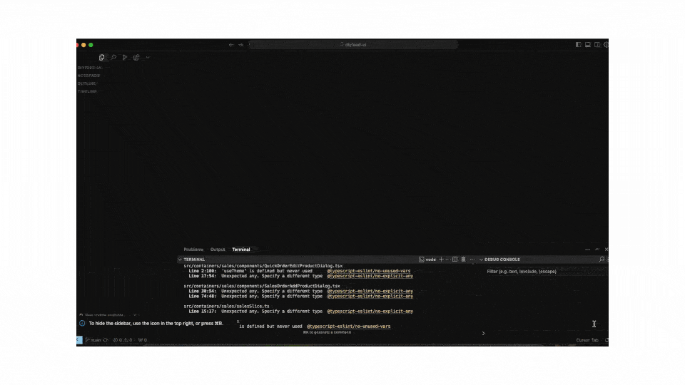

# react-jump2source

A React library that enables quick navigation from the UI elements to the source code using your favourite IDE.



## Installation

```bash
npm install react-jump2source --save-dev
```

## Setup

### For Create React App Projects

1. Install CRACO:
```bash
npm install @craco/craco --save-dev
```

2. Create a `craco.config.js` file in your project root:
```javascript
module.exports = {
  babel: {
    plugins: [
      require('react-jump2source/babel')
    ]
  }
};
```

3. Update your package.json scripts to use CRACO:
```json
{
  "scripts": {
    "start": "craco start",
    "build": "craco build",
    "test": "craco test"
  }
}
```

### For Custom React Projects

Add the Babel plugin to your `.babelrc` or `babel.config.js`:
```json
{
  "plugins": [
    "react-jump2source/babel"
  ]
}
```

## Usage

```tsx
import { initJ2S } from 'react-jump2source';

function App() {
  // Only initialize react-jump2source in development
  useEffect(() => {
    if (process.env.NODE_ENV === 'development') {
      initJ2S({
        projectDir: process.env.REACT_APP_WORKSPACE_ROOT || '',
        resolver: process.env.REACT_APP_J2S_RESOLVER || 'cursor'
      });
    }
  }, []);

  return (
    // Your app components
  );
}
```

### Configuration Options

- `projectDir` (required): Absolute path to your project's root directory. Example: /Users/John/repos/myReactApp
- `enabled` (optional): Whether the feature is enabled. Defaults to `process.env.NODE_ENV === 'development'`
- `resolver` (optional): How to generate the IDE URL. Can be:
  - `'cursor'`: Uses Cursor IDE format
  - `'vscode'`: Uses VS Code format
  - A custom function: `(filePath: string) => string`

Example of a custom resolver for using another IDEs (WebStorm, IntelliJ, etc.):
```tsx
initJ2S({
  projectDir: process.env.REACT_APP_WORKSPACE_ROOT || '',
  // The filePath argument will be in the format: components/MyComponent.tsx:32
  // where the last number is the line number in the file
  resolver: (filePath) => `anotherApp://openFile://${filePath}`
});
```

2. Set the `REACT_APP_WORKSPACE_ROOT` environment variable to your project's root directory:

```env
REACT_APP_WORKSPACE_ROOT=/path/to/your/project
```

## Features

- Automatically adds `data-source` attributes to components in development mode
- Enables ctrl/cmd-click navigation from browser to your preferred IDE
- Supports multiple IDEs (Cursor, VS Code) with predefined resolvers
- Works with Create React App and custom React projects
- TypeScript support
- Zero impact in production builds

## License

MIT 